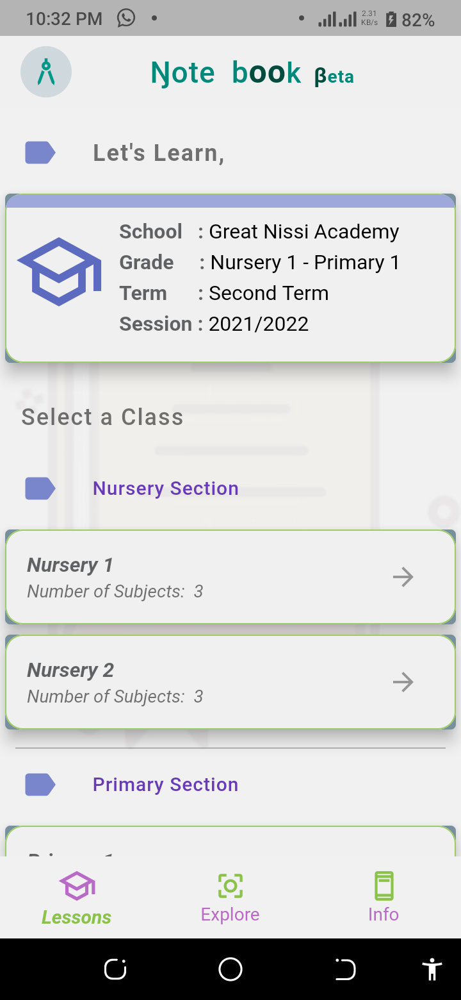
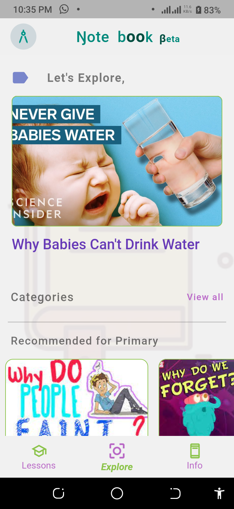
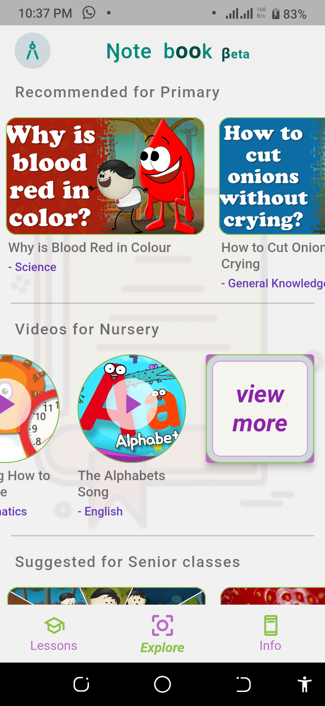
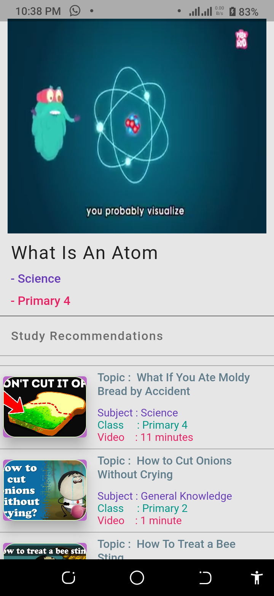
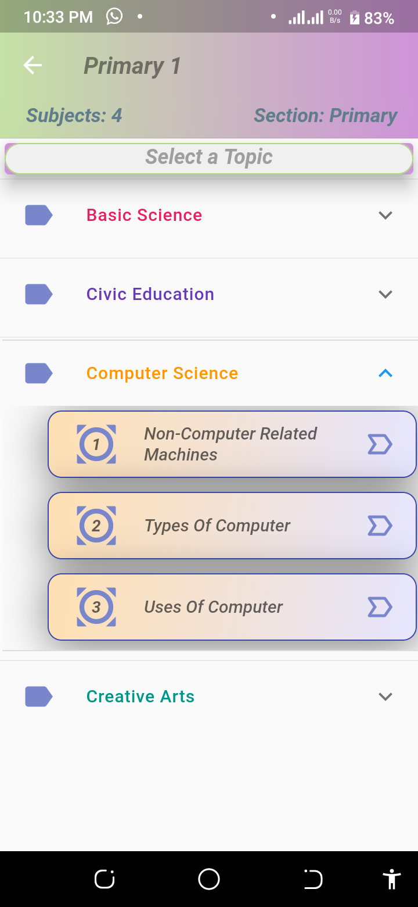
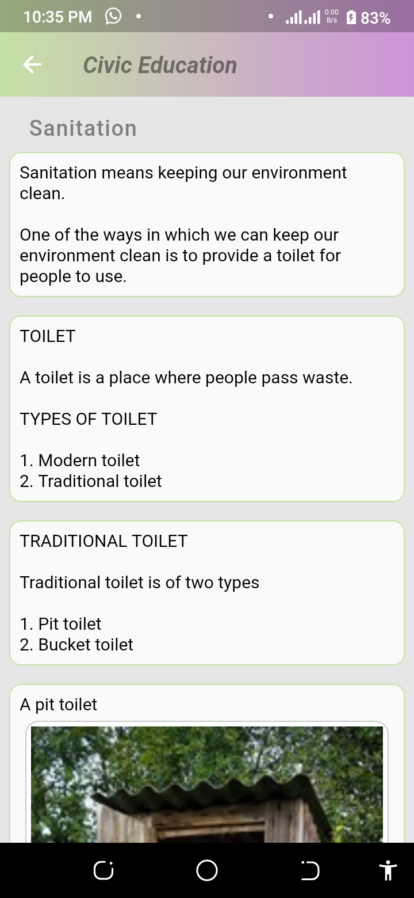
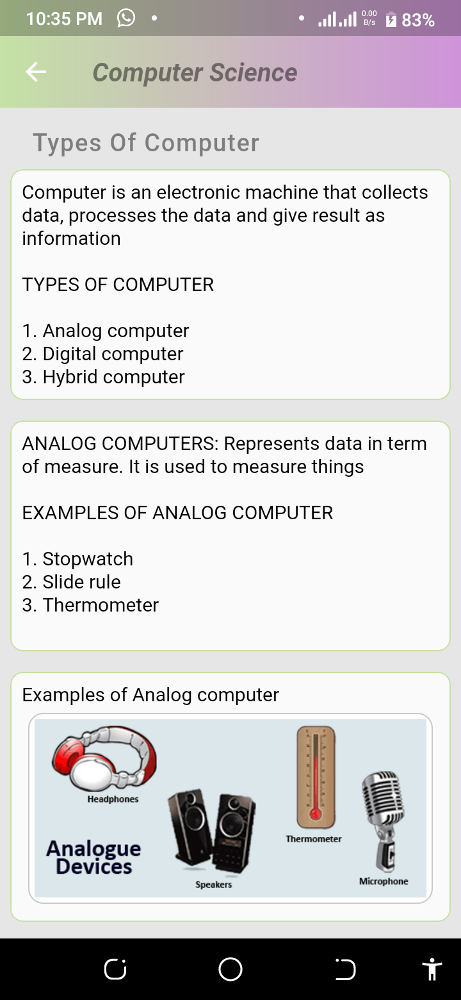
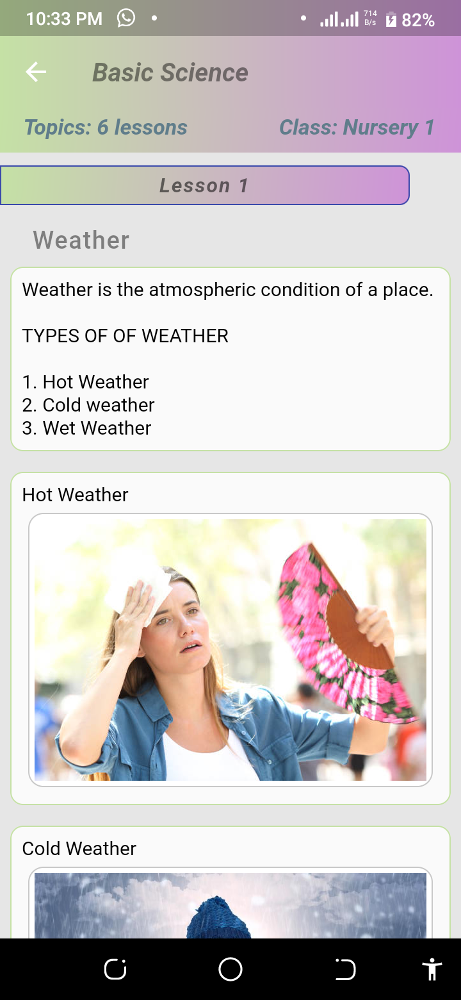

# Notebook (Beta)

An intuitive approach in attempting to solve some problems the author of this project observed while serving as a teacher in the Elementary School System... Details are provide in [Notebook's Mission](Notebook's_Mission.pdf)  

## Preview

















## ALERT
**This is no longer maintained... The author of this project does not recommend copying this code as there are MANY bad practice methods which never got to be refactored. But it works!!!**

## Features
- Lessons Section of the app where pupils, parents and teachers gain access to pupils subjects topics | requirements | and explanations, ranked by grade...

- Explore Section of the app that grants pupils access to a plethora of educational discovery and amusement, in line with their grade...

### Supressed Features
  - Syllabus
  - Timetable
  - Class Info
  - Practice Tests
  - School Info
  - Term Activities

## Content Copyright claims

Media contents used in this project belong to their respective creators/ authors from their respective platforms. No claim has and shall be made by the author of this project and the users of this project...

## Tech Stats
**Server**: Firebase Auth, Firebase Storage, Firebase Firestore

**Client**: Flutter


## Getting started


#### 1. [Setup Flutter](https://flutter.io/setup/)

#### 2. Clone the repo

```sh
$ git clone https://github.com/x9x96/Notebook_Beta
$ cd Instagram-Clone/
```

#### 3. Setup the firebase app

1. You'll need to create a Firebase instance. Follow the instructions at https://console.firebase.google.com.
2. Once your Firebase instance is created, you'll need to enable anonymous authentication.

* Go to the Firebase Console for your new instance.
* Click "Authentication" in the left-hand menu
* Click the "sign-in method" tab
* Click "Google" and enable it


#### 4. Enable the Firebase Database
* Go to the Firebase Console
* Click "Database" in the left-hand menu
* Click the Cloudstore "Create Database" button
* Select "Start in test mode" and "Enable"

#### 5. (skip if not running on Android)

* Create an app within your Firebase instance for Android, with package name com.mohak.instagram
* Run the following command to get your SHA-1 key:

```
keytool -exportcert -list -v \
-alias androiddebugkey -keystore ~/.android/debug.keystore
```

* In the Firebase console, in the settings of your Android app, add your SHA-1 key by clicking "Add Fingerprint".
* Follow instructions to download google-services.json
* place `google-services.json` into `/android/app/`.


#### 6. (skip if not running on iOS)

* Create an app within your Firebase instance for iOS, with your app package name
* Follow instructions to download GoogleService-Info.plist
* Open XCode, right click the Runner folder, select the "Add Files to 'Runner'" menu, and select the GoogleService-Info.plist file to add it to /ios/Runner in XCode
* Open /ios/Runner/Info.plist in a text editor. Locate the CFBundleURLSchemes key. The second item in the array value of this key is specific to the Firebase instance. Replace it with the value for REVERSED_CLIENT_ID from GoogleService-Info.plist

Double check install instructions for both
   - Google Auth Plugin
     - https://pub.dartlang.org/packages/firebase_auth
   - Firestore Plugin
     -  https://pub.dartlang.org/packages/cloud_firestore
     
## How to Contribute
1. Fork the the project
2. Create your feature branch (git checkout -b my-new-feature)
3. Make required changes and commit (git commit -am 'Add some feature')
4. Push to the branch (git push origin my-new-feature)
5. Create new Pull Request
